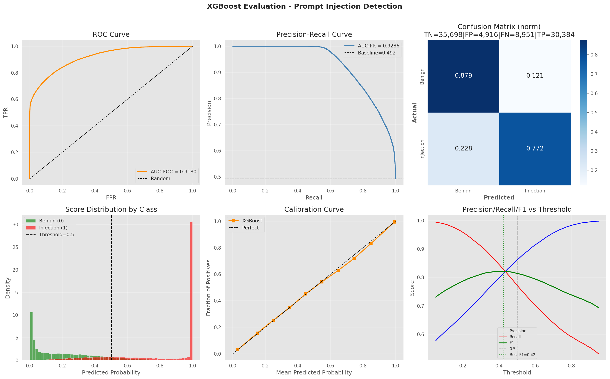
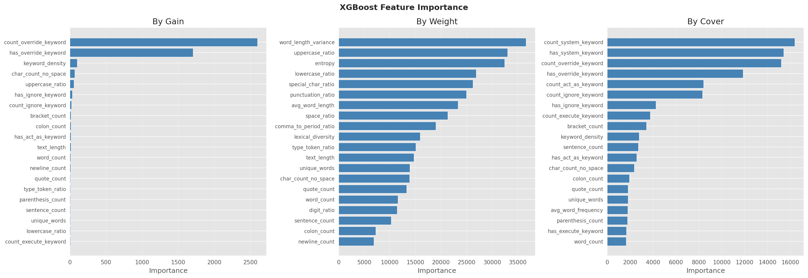
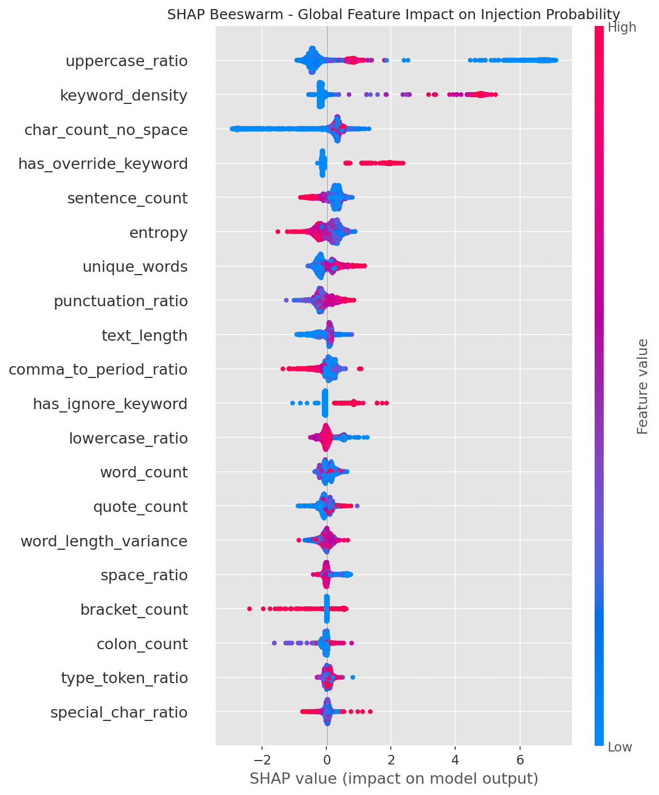

# Resultados — Detecção de Prompt Injection com XGBoost

## Visão Geral

| Item | Valor |
|---|---|
| **Problema** | Classificação binária: prompt injection vs. benigno |
| **Dataset** | 399.741 amostras · 35 features · classes balanceadas (50,8% / 49,2%) |
| **Modelo** | XGBoost 3.2.0 (GPU — CUDA 13.2) |
| **Otimização** | Optuna 4.8.0 · 100 trials · TPE Sampler · 5-fold CV |
| **Métrica primária** | AUC-ROC (maximização) |

---

## Divisão dos Dados

| Conjunto | Amostras | % |
|---|---|---|
| Treino | 319.792 | 80% |
| Teste (holdout) | 79.949 | 20% |

Estratificação verificada: distribuição de classes idêntica entre treino e teste.

---

## Melhores Hiperparâmetros (Optuna)

| Parâmetro | Valor |
|---|---|
| `n_estimators` (máx.) | 2.639 |
| `n_estimators` (utilizadas) | **2.397** (early stopping) |
| `max_depth` | 8 |
| `learning_rate` | 0.01424 |
| `subsample` | 0.8461 |
| `colsample_bytree` | 0.9357 |
| `min_child_weight` | 1 |
| `gamma` | 0.00612 |
| `reg_alpha` | 0.8675 |
| `reg_lambda` | 9.86 × 10⁻⁸ |

AUC-ROC médio na validação cruzada (5-fold): **0.918307**

---

## Métricas no Conjunto de Teste (Holdout)

| Métrica | Valor |
|---|---|
| **AUC-ROC** | **0.9180** |
| **AUC-PR** | **0.9286** |
| Acurácia | 0.8266 |
| Precisão | 0.8607 |
| Recall | 0.7724 |
| F1 Score | 0.8142 |

### Matriz de Confusão

|  | Previsto: Benigno | Previsto: Injection |
|---|---|---|
| **Real: Benigno** | TN = 35.698 | FP = 4.916 |
| **Real: Injection** | FN = 8.951 | TP = 30.384 |

- **Taxa de falsos positivos** (benignos classificados como injection): 12,1%
- **Taxa de falsos negativos** (injections não detectadas): 22,8%

---

## Gráficos de Avaliação

Os seis painéis mostram:

1. **ROC Curve** — AUC-ROC = 0.9180, bem acima da linha de base aleatória.
2. **Precision-Recall Curve** — AUC-PR = 0.9286; alta precisão mantida mesmo com recall elevado.
3. **Confusion Matrix (normalizada)** — 87,9% dos benignos e 77,2% das injections classificados corretamente.
4. **Score Distribution** — boa separação entre as classes; maioria das predições concentrada nos extremos (0 e 1).
5. **Calibration Curve** — probabilidades bem calibradas, próximas à curva perfeita.
6. **Precision/Recall/F1 vs. Threshold** — F1 máximo (~0.814) alcançado com threshold ≈ 0.42, próximo ao padrão de 0.5.

---

## Importância das Features

As três métricas de importância (Gain, Weight, Cover) convergem nas principais features:

- **Gain (impacto médio nas divisões):** `count_override_keyword`, `has_override_keyword`, `keyword_density`, `char_count_no_space`, `uppercase_ratio`.
- **Weight (frequência de uso):** `word_length_variance`, `uppercase_ratio`, `entropy`, `lowercase_ratio`, `special_char_ratio`.
- **Cover (amostras cobertas):** `count_system_keyword`, `has_system_keyword`, `count_override_keyword`, `has_override_keyword`, `has_ignore_keyword`.

Features relacionadas a **palavras-chave de override/system/ignore** e **características tipográficas** (maiúsculas, entropia, densidade de keywords) são as mais discriminativas.

---

## Análise SHAP

O beeswarm SHAP (2.000 amostras) confirma e detalha os padrões de importância:

| Feature | Direção do impacto |
|---|---|
| `uppercase_ratio` alto | forte indicador de injection (SHAP positivo alto) |
| `keyword_density` alta | forte indicador de injection |
| `char_count_no_space` alto | tendência para injection |
| `has_override_keyword` = 1 | impacto positivo forte e consistente |
| `sentence_count` baixo | associado a injection (textos curtos/diretos) |
| `entropy` intermediária | neutro a levemente positivo |
| `unique_words` baixo | leve tendência para injection |

Textos benignos tendem a apresentar valores baixos nessas features, gerando SHAP negativos.

---

## Análise de Erros

| Tipo | Quantidade | % do teste |
|---|---|---|
| Falsos Positivos | 4.916 | 6,15% |
| Falsos Negativos | 8.951 | 11,20% |
| Corretos (Benigno) | 35.698 | 44,65% |
| Corretos (Injection) | 30.384 | 38,00% |

Os falsos negativos (injections não detectadas) são mais frequentes que os falsos positivos, o que sugere que subconjuntos de injections com escrita natural (baixo `uppercase_ratio`, baixa `keyword_density`) escapam ao modelo.

---

## Artefatos Gerados

| Arquivo | Tamanho |
|---|---|
| `models/xgboost_model.json` | ~46,8 MB |
| `models/best_params.json` | 0,3 KB |
| `models/evaluation_metrics.json` | 0,4 KB |
| `models/optuna_study.pkl` | 66,9 KB |
| `docs/results/images/evaluation_plots.png` | ~309 KB |
| `docs/results/images/feature_importance.png` | ~206 KB |
| `docs/results/images/shap_beeswarm.png` | ~212 KB |
